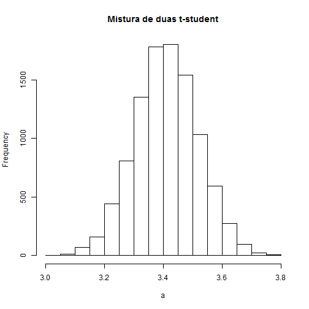

TopicModelppt
========================================================
author: Manoel Galdino
date: 22/07/2014
Tópic Models - Introdução

Topic Model - Introdução
========================================================
O que é a modelagem estatística de tópicos?

- Para entendermos a intuição da LDA começemos com um
exemplo fictício de 5 frases
- O exemplo foi criado por mim e não tem análise
estatística nenhuma.
- mas reflete o espírito da LDA


Exemplo
========================================================

- Gosto de Cerveja e Batata Frita
- Também curto tomar cerveja bem gelada com calabresa
- Corinthians e CSA são meus times do coração
- Meu irmão torce pro Botafogo e CSA.
- Curto tomar uma vendo jogo do Corinthians.


Latent Dirichlet Allocation (LDA)
========================================================
Se LDA for inferir 2 tópicos para essas frases:

- Frases 1 and 2: 100% Tópico A
- Frases 3 and 4: 100% Tópico B
- Frase 5: 40% Tópico A, 60% Tópico B
- Tópico A: 30% cerveja, 15% Calabresa, 10% Batata, 10% Frita, … (e então podemos concluir que se trata de comida)
- Tópico B: 20% Corinthians, 20% Botafogo, 20% meu, 15% time, … (e então podemos concluir que se trata de futebol)
- Como LDA descobre os tópicos?


Topic Model - Introdução
========================================================
O que é a modelagem estatística de tópicos?

- Modelos estatísticos de tópicos (temas) permitem
a descoberta de tópicos latentes em textos
- É conhecido como um método de aprendizagem
não-supervisionado
- não supervisionado, pois infere o tópico
- Tópico é uma distrib de probabilidade s/ palavras,
ou seja, cada palavra tem uma prob. de ocorrer num
dado tópico

Topic Model - Introdução
========================================================
No Topic Models, tudo se passa como se quando vamos 
escrever um documento, nós

- Decidimos o número de palavras que o doc. terá de 
acordo com algum distr. de prob. (ex. Poisson)
- Escolhemos uma mistura de tópicos para o doc.
- No nosso ex. acima, com 2 tópicos (comida e futebol),
podemos decidir que o doc. terá 1/3 de futebol e 2/3 de 
comida.
- E geramos cada palavra w_i do doc. de acordo com a
seguinte regra:


Topic Model - Introdução
========================================================

- Primeiro escolhemos um tópico (com as prob. acima)
- Gera a palavra de acordo com a distrib. do tópico
- Lembrem-se que o tópico nos dá uma prob. para a 
ocorrência de cada palavra.
- no nosso exemplo, no tópico futebol, Corinthians tem
30% de prob., Botafogo 1%, Cerveja 2% etc.
- Assumindo um modelo desse tipo, a LDA tenta descobrir
os tópicos mais prováveis de terem gerado nossas frases


========================================================

```r
set.seed(2)
m <- rnorm(10000, 1.78, 0.077)
f <- rnorm(10000, 1.63, 0.073)
a <- m+f
```

Slide With Plot
========================================================

 
